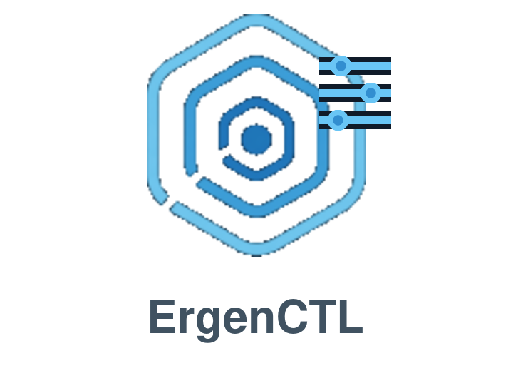

<p align="center">
  
</p>

<h1 align="center">ErgenCTL</h1>

<p align="center">
  Diagnostics, repair and snapshot recovery for ErgenOS.
</p>

<p align="center">
  <a href="https://github.com/ErgenosSW/ErgenCTL/releases"></a>
  <a href="https://github.com/ErgenosSW/ErgenCTL/blob/main/LICENSE"></a>
</p>

> [!WARNING]
> ErgenCTL 0.1.1-alpha is experimental software. Recovery operations modify Btrfs subvolumes and boot configuration. Keep a verified backup before using repair or rollback commands.

## Overview

ErgenCTL is a command-line recovery utility built for ErgenOS. It inspects the installed system, reports boot and snapshot problems, repairs supported configuration faults and can restore the base Btrfs root from a Snapper snapshot.

The recovery workflow is designed for a system that no longer starts normally:

1. Boot a working snapshot from the GRUB snapshot menu.
2. Run ErgenCTL from that snapshot.
3. Inspect the base installation with a dry run.
4. Repair selected components or restore a known-good snapshot.
5. Reboot into the normal ErgenOS entry.

When started from a snapshot, ErgenCTL mounts the real base installation and performs repairs there. It does not write changes into the temporary snapshot overlay.

## Current capabilities

- Compact system status and extended diagnostics
- Human-readable and JSON output
- Current and previous boot journal inspection
- Log filtering for resume, boot, audio and graphics problems
- Btrfs and Snapper snapshot inspection
- Detection of normal, live and snapshot boot modes
- Hibernation resume configuration checks
- Repair planning with `--dry-run`
- Configuration backups before repair
- Btrfs safety snapshots during recovery
- Repair of Pacman repositories and snapshot hooks
- Repair of snapshot-related systemd services
- Regeneration of GRUB snapshot configuration
- Rebuilding of resume configuration, initramfs and GRUB
- Restoration of the base `@` subvolume from a selected Snapper snapshot
- Preservation of the replaced root subvolume for manual recovery

## Requirements

ErgenCTL targets ErgenOS installations using:

- Btrfs with a dedicated root subvolume
- Snapper with the `root` configuration
- grub-btrfs
- GRUB
- systemd
- mkinitcpio
- arch-chroot
- Python 3.10 or newer

Diagnostic commands can run without root privileges where system permissions allow it. Repair and rollback operations require root privileges.

## Usage

ErgenCTL is installed in ErgenOS as the native `ergenctl` command:

```bash
ergenctl --help
```

### System status

```bash
ergenctl status
ergenctl status --json
```

### Extended diagnostics

```bash
sudo ergenctl doctor
```

### Snapshot information

```bash
sudo ergenctl snapshots
sudo ergenctl snapshots --json
```

### Boot journal

```bash
sudo ergenctl logs
sudo ergenctl logs --previous --priority warning
sudo ergenctl logs --category resume --priority warning
sudo ergenctl logs --category boot --raw
```

Available log categories:

- `all`
- `resume`
- `boot`
- `audio`
- `graphics`

### Resume diagnostics

```bash
sudo ergenctl resume
sudo ergenctl resume --json
```

## Repair

Supported repair targets:

- `repositories`
- `pacman-hooks`
- `services`
- `resume`
- `grub-snapshots`
- `all`

Always inspect a repair plan first:

```bash
sudo ergenctl fix all --dry-run
```

Apply the required repairs:

```bash
sudo ergenctl fix all --yes
```

Without `--yes`, ErgenCTL asks for confirmation. By default, it creates a safety snapshot before changing a recoverable Btrfs installation. The `--no-snapshot` option disables that protection and should be used only when another verified backup exists.

## Rollback from a snapshot

Rollback is available only when ErgenOS is running from a snapshot. It replaces the base root subvolume with a writable copy of the selected snapshot.

List snapshots and choose the required number:

```bash
sudo ergenctl snapshots
```

Inspect the rollback plan:

```bash
sudo ergenctl rollback 8 --dry-run
```

Apply the rollback:

```bash
sudo ergenctl rollback 8 --yes
```

During rollback, ErgenCTL:

1. Mounts the top level of the Btrfs filesystem.
2. Verifies the selected Snapper snapshot.
3. Creates a writable copy of that snapshot.
4. Preserves the damaged root as `@-broken-<timestamp>`.
5. Promotes the restored copy to the configured root subvolume.
6. Rebuilds initramfs and GRUB.
7. Regenerates the GRUB snapshot menu.
8. Unmounts the recovery environment.

Do not remove the preserved `@-broken-*` subvolume until the restored system has booted and passed verification.

## JSON output

Machine-readable output is available for diagnostics, logs, repairs and rollback operations:

```bash
ergenctl doctor --json
sudo ergenctl fix all --dry-run --json
sudo ergenctl rollback 8 --dry-run --json
```

The current JSON schema version is `1`.

## Tests

Run the test suite with:

```bash
python3 -m unittest discover -s tests -v
```

The recovery and rollback paths have also been tested in a QEMU/KVM ErgenOS installation. The integration test covered a non-booting base system, startup from a GRUB snapshot, restoration of the root subvolume and a successful normal boot after recovery.

## Project status

ErgenCTL is currently an alpha project. The tested workflow is based on the ErgenOS Btrfs and Snapper layout. Other distributions and custom storage layouts are not supported repair targets.

## License

ErgenCTL is licensed under the GNU General Public License v3.0. See [LICENSE](LICENSE).
